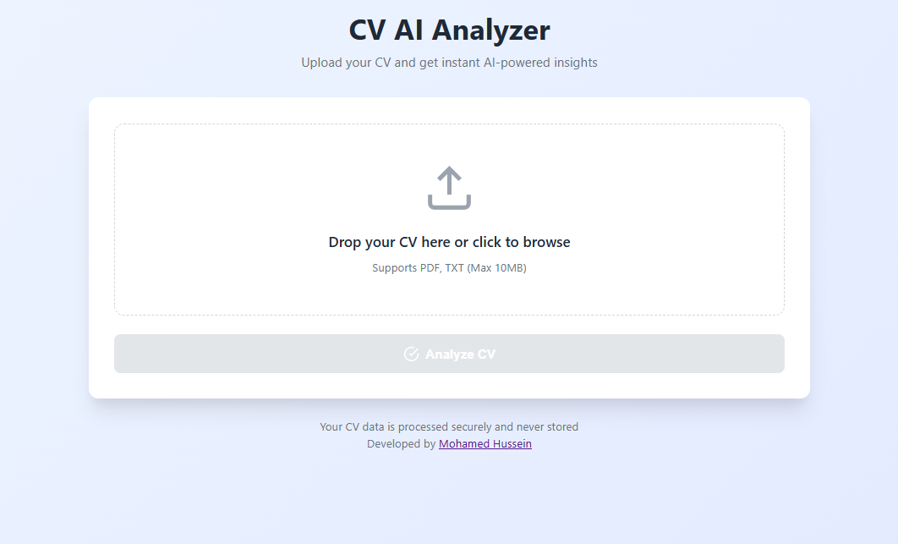
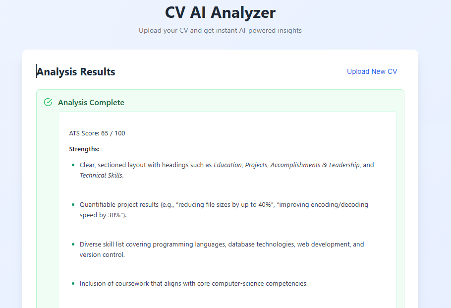

# 📄 AI-Powered ATS CV Analyzer

An AI-powered web application that analyzes resumes (CVs) for **ATS (Applicant Tracking System) compatibility**.  
Users can upload their CV and receive an **ATS score**, **strengths**, **weaknesses**, and **actionable improvement suggestions**.

---

## 🚀 Features

- Upload CV files (**PDF, DOC, DOCX, TXT**)
- ATS compatibility scoring (0–100)
- Strengths & weaknesses analysis
- Actionable resume improvement suggestions
- Keyword recommendations for ATS optimization
- Stateless analysis (fresh evaluation on every upload)
- Simple drag-and-drop UI

---

## 🧠 How It Works

1. User uploads a CV file from the frontend.
2. The file is sent to Flowise using **Full File Upload**.
3. The entire CV content is injected into the LLM prompt.
4. The AI analyzes the CV strictly based on the uploaded document.
5. Results are returned in a structured ATS-focused format.

This approach avoids conversational confusion and ensures consistent, deterministic analysis.

## use
First, you upload the image


Then the AI replies with the answer



---

## 🛠️ Tech Stack

### Frontend
- HTML
- CSS
- Vanilla JavaScript
- Drag & Drop File Upload

### Backend / AI
- **Flowise** (LLM orchestration)
- Full File Uploads (non-RAG)
- OpenAI-compatible / OSS LLM
- Stateless architecture (no memory)

---

## 📂 Supported File Types

- `.pdf`
- `.txt`

**Max file size:** 10 MB

---

## 📑 Output Format

```text
ATS Score: XX / 100

Strengths:
- ...

Weaknesses:
- ...

Improvements:
- ...

(Optional) Keyword Suggestions:
- ...
